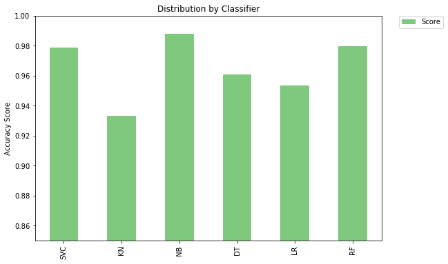
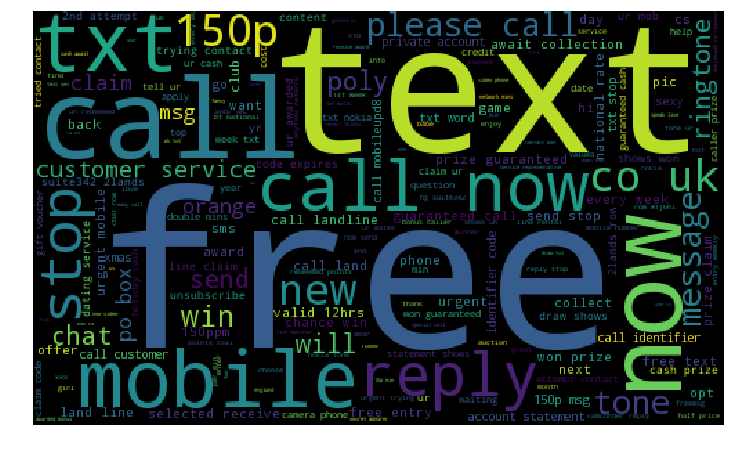

# SMS-Spam-Classification

### About

We try to classify SMS messages as SPAM or NOT SPAM using various ML algorithms. The notebook (spam_classifier.ipynb)consists steps to process and explore the dataset, convert messages to vectors and applying ML techniques for the same.

The notebook(spam_classifier_rnn.ipynb) uses a Recurrent Neural Network (RNN) and LSTM to classify the messages. RNNs are networks with loops in them, allowing information from previous time step to persist capable of handling long-term dependencies.

### Install

This project requires **Python 3** and the following Python libraries installed:

- [xgboost](xgboost.readthedocs.io/en/latest/build.html)
- [wordcloud](https://github.com/amueller/word_cloud)
- [sklearn](scikit-learn.org/)
- [pandas](https://pandas.org/)
- [nltk](https://nltk.org/)
- [Matplotlib](https://matplotlib.org/)

Make sure you have [Jupyter Notebook](http://ipython.org/notebook.html) installed.

You could just install [Anaconda](http://continuum.io/downloads) distribution of Python, which already has the above packages and more included. 


### Run

In a terminal or command window, navigate to the top-level project directory (that contains this README) and run one of the following commands:

```bash
ipython notebook spam_classifier.ipynb
```  
or
```bash
jupyter notebook spam_classifier.ipynb
```

This will open the Jupyter Notebook software and project file in your browser.

### Dataset

The Dataset is a set of SMS tagged messages  collected for SMS Spam research. It contains one set of SMS messages in English of 5,574 messages, tagged acording being ham (legitimate) or spam.

The dataset is available [here.](https://archive.ics.uci.edu/ml/datasets/SMS+Spam+Collection)

Example Messages:

```
ham What you doing?how are you? 
ham Ok lar... Joking wif u oni... 
ham dun say so early hor... U c already then say... 
ham MY NO. IN LUTON 0125698789 RING ME IF UR AROUND! H* 
ham Siva is in hostel aha:-. 
ham Cos i was out shopping wif darren jus now n i called him 2 ask wat present he wan lor. Then he started guessing who i was wif n he finally guessed darren lor. 
spam FreeMsg: Txt: CALL to No: 86888 & claim your reward of 3 hours talk time to use from your phone now! ubscribe6GBP/ mnth inc 3hrs 16 stop?txtStop 
spam Sunshine Quiz! Win a super Sony DVD recorder if you canname the capital of Australia? Text MQUIZ to 82277. B 
spam URGENT! Your Mobile No 07808726822 was awarded a L2,000 Bonus Caller Prize on 02/09/03! This is our 2nd attempt to contact YOU! Call 0871-872-9758 BOX95QU 

```

## Results 
The predictions(accuracy scores) using various ML algorithms are as follows:



- [SVC](https://en.wikipedia.org/wiki/Support_vector_machine)
- [KN](https://en.wikipedia.org/wiki/K-nearest_neighbors_algorithm)
- [NB](https://en.wikipedia.org/wiki/Naive_Bayes_classifier#Multinomial_naive_Bayes)
- [LR](https://en.wikipedia.org/wiki/Logistic_regression)
- [RF](https://en.wikipedia.org/wiki/Random_forest)
- [DT](https://en.wikipedia.org/wiki/Decision_tree_learning)


The Wordclouds below show the most common words occuring in each of the categories:

SPAM




NOT SPAM


###### Validation accuracy using RNN is 81% and Test accuracy is 79%
